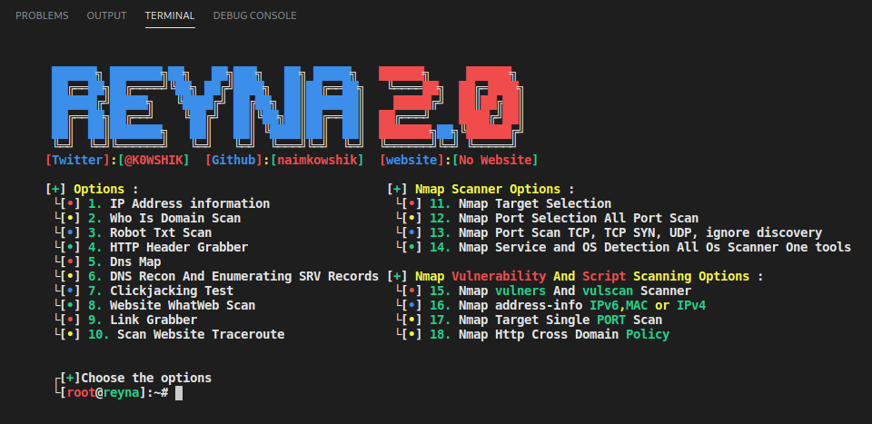

<p align="center">
  
</p>
<div align="center"> 
  <a href="https://github.com/naimkowshik/reyna-eye">
    
  </a>
  <a href="https://www.python.org/">
    
  </a>
  <a href="https://twitter.com/K0WSHIK">
    
  </a>
</div>
<br />

**ONLY DOWNLOAD IT HERE, DO NOT TRUST OTHER PLACES.**

Written by: [ **TeamKurais** ]-[ **Twitter** ] [@K0WSHIK](https://twitter.com/K0WSHIK), [ **GitHub** ] [@naimkowshik](https://github.com/naimkowshik)

## 🔖 About

We have created this tool that many new people come in the world of pen testing & Ethical Hacking. They do not know much about the basics. So this tool has been created to help them. I hope you share this tool with your new friends.

[ **DISCLAIMER** ] **:** This is only for testing purposes and can only be used where strict consent has been given. Do not use this for illegal purposes, period.

# 📃 Features
#### [ Menu ] :
* IP Address information
* Who Is Domain Scan
* Robot Txt Scan
* HTTP Header Grabber
* Dns Map
* DNS Recon And Enumerating SRV Records
* Clickjacking Test
* Website WhatWeb Scan
* Link Grabber

#### [ Nmap Scanner Options ]:
 * Nmap Target Selection
 * Nmap Port Selection All Port Scan
 * Nmap Port Scan TCP, TCP SYN, UDP, ignore discovery
 * Nmap Service and OS Detection All Os Scanner One tools

#### [ Nmap Vulnerability And Script Scanning ]:
 * Nmap vulners And vulscan Scanner
 * Nmap address-info IPv6,MAC or IPv4
 * Nmap Target Single PORT Scan
 * Nmap Http Cross Domain Policy

## 📝 Bugs and enhancements

For bug reports or enhancements, please open an [issue](https://github.com/naimkowshik/reyna-eye/issues) here.


## 🎨 Tested on
* Kali linux 
* Parrot-Sec 

# ⏳ Installation

**make sure your apt-get isn't broken before you run this**

**RUN THIS AS ROOT**

```bash
$ git clone https://github.com/naimkowshik/reyna-eye.git
$ cd reyna-eye
$ chmod +x setup.py
$ python3 setup.py
$ python3 reyna.py
```
**IF YOU WANT TO ADD THIS TOOL PERMANENT LIKE THIS OPEN TERMINAL AND TYPER :( reyna )**

 * Go To Your .zshrc File
 * Open Any Text Editor
 * Go End Of Line
 * Now Just ( alias reyna="python3 /opt/reyna/reyna.py" )
 * Done ! Open New Terminal Just Type reyna

# 📸 SCREENSHOT

